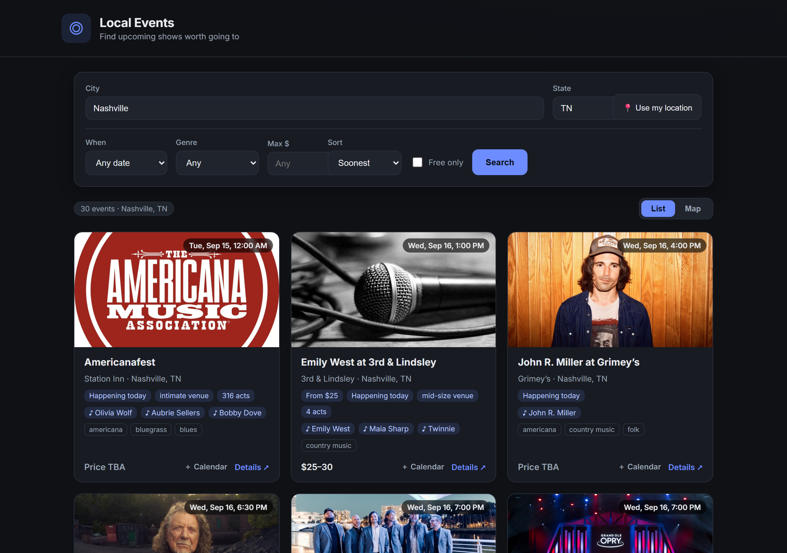
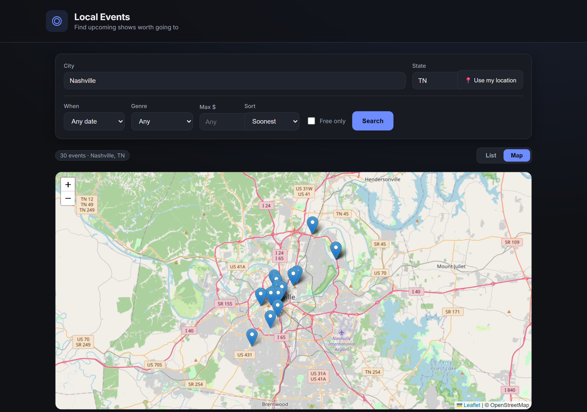

# Local Events Discovery

Find upcoming events near you and decide which one is worth going to. A Python
**FastAPI** backend pulls live data from the **JamBase Concert Data API**, normalizes
it, and layers on decision-support signals (price, timing, venue size, distance);
a lightweight vanilla-JS UI presents them as a clean, scannable feed.

> **Case study for Skystrike.** Built to demonstrate backend design, reliability,
> and extensibility. See [`WRITEUP.md`](WRITEUP.md) for the design writeup, AI-usage
> notes, limitations, the 10-provider evolution plan, and self-grades.




*Live JamBase data: list view with decision-support signals, artist links, and
add-to-calendar; interactive venue map.*

---

## Quick start (zero setup)

The app ships with a bundled sample dataset, so it runs with **no API key**.

```bash
python -m venv .venv
# Windows:  .venv\Scripts\activate
# macOS/Linux: source .venv/bin/activate
pip install -r requirements.txt
uvicorn app.main:app --reload
```

Open **http://localhost:8000**. You'll see a "sample data" banner until you add a key.

### Live data (JamBase)

Grab a free 14-day trial key at
<https://data.jambase.com/api/docs/getting-started>, then:

```bash
cp .env.example .env      # Windows: copy .env.example .env
# edit .env and set JAMBASE_API_KEY=...
uvicorn app.main:app --reload
```

The app now queries JamBase live; the banner disappears.

---

## Features

City or **"Use my location"** search · date / genre / max-price / free-only filters ·
**list & map** views · decision signals (price, timing, venue size, distance, lineup) ·
artist links · one-click **add-to-calendar (.ics)**. Backend-first: a provider
abstraction, resilient HTTP (retry + backoff, 429-aware), TTL caching, and a
zero-setup sample mode.

## How it works

### User flow

```text
 Open app
    │
    ▼
 Choose a location ──┬─ type City (+ State)
    │                └─ or tap "Use my location"  (browser GPS)
    ▼
 (optional) Refine:  When · Genre · Max $ · Free-only · Sort
    │
    ▼
 Browse results ─────────────────►  switch  List  ⇄  Map
    │
    ├─ scan signals: price/free · how soon · venue size · distance · lineup
    ├─ open artist links  /  event "Details"
    └─ tap "+ Calendar" ─► download .ics ─► add to personal calendar
```

### System flow

```text
 Browser  (web/app.js)
    │  GET /api/events?city=&state=&when=&genre=&max_price=&free_only=&sort=
    ▼
 FastAPI route  (api/routes.py)
    │  validate input · expand date presets ─► EventQuery
    ▼
 EventsService  (services/events_service.py)
    │  concurrent fan-out to providers
    ▼
 ┌──────────────────────── EventProvider ────────────────────────┐
 │ JamBaseProvider (jambase.py)      [+ future: Ticketmaster, …]  │
 │   1. resolve City → geoCityId ....... TTL cache (geo, 1 day)   │
 │   2. GET JamBase /events ............ ResilientClient          │
 │                                        (retry+backoff+jitter,  │
 │                                         429 / Retry-After)     │
 │                                       TTL cache (events, 5 min)│
 │   3. map_event() .................... normalized Event         │
 └───────────────────────────────────────────────────────────────┘
    │  merge → dedupe → filter (free/price) → rank + enrich → sort
    ▼
 EventSearchResponse (JSON) ─► Browser renders  List / Map
```

## API

Interactive docs at **http://localhost:8000/docs** (FastAPI/OpenAPI).

| Endpoint | Description |
|---|---|
| `GET /api/events` | Search events. Location via `city`(+`state`) **or** `lat`+`lon`(+`radius_km`). Also: `when=today\|weekend\|week`, `date_from`, `date_to`, `genre`, `keyword`, `free_only`, `max_price`, `page`, `per_page`, `sort=date\|relevance`. |
| `GET /api/events/calendar.ics?id=<event_id>` | Download a single event as an `.ics` calendar file. |
| `GET /api/health` | Liveness + whether sample data is in use. |

```bash
curl "http://localhost:8000/api/events?city=Nashville&state=TN&sort=relevance"
curl "http://localhost:8000/api/events?lat=36.16&lon=-86.78&radius_km=25"
```

## Tests

```bash
pytest -q
```

34 tests cover normalization (incl. live-data edge cases), the retry/backoff policy
(mocked transport), the ranking layer, the `.ics` builder, the live provider path,
and the HTTP API (filters, presets, calendar download).

## Project layout

```
app/
  main.py               # FastAPI app + lifespan (shared client/cache/service)
  config.py             # settings (env / .env), safe defaults
  models.py             # normalized, provider-agnostic domain models
  api/routes.py         # thin HTTP layer
  providers/
    base.py             # EventProvider interface — the extensibility seam
    jambase.py          # JamBase v3 adapter + normalizer (pure map_event)
    sample.py           # zero-setup fallback (reuses the JamBase normalizer)
  services/
    http_client.py      # resilient httpx client: retry + backoff + jitter, 429-aware
    cache.py            # async TTL cache (request reduction)
    ranking.py          # deterministic decision-support signals + scoring
    calendar.py         # pure RFC-5545 .ics builder
    events_service.py   # concurrent fan-out, merge, dedupe, filter, enrich, sort
  fixtures/             # sample data in raw JamBase shape
web/                    # index.html + app.js + styles.css (no build step)
tests/
```

## Time spent

~2 hours. See [`WRITEUP.md`](WRITEUP.md) for the full breakdown.
